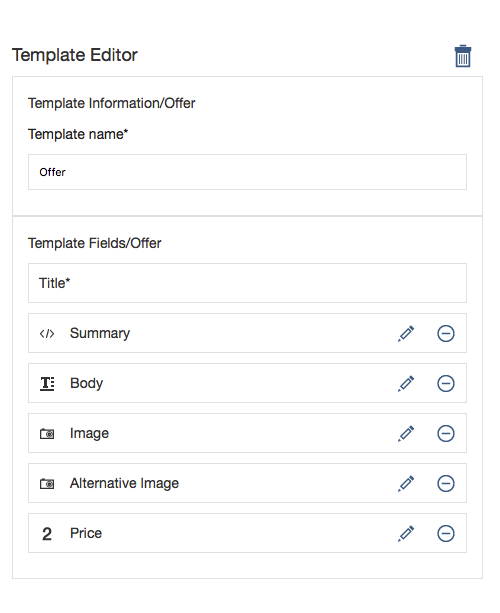
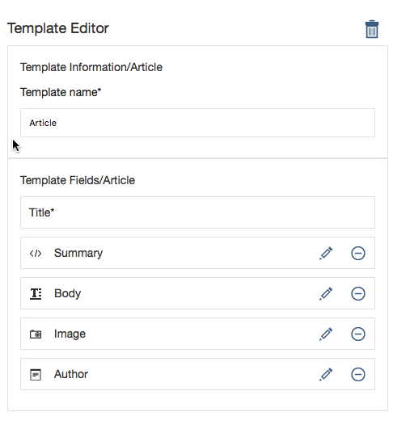
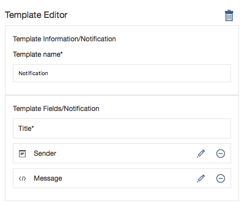
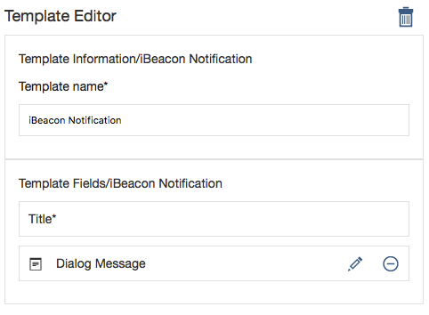

## Native iOS version of the Greenwell banking app
This application illustrates how to use the CAASObjC SDK for iOS in order to use MACM features for adaptive content.

## Requirements

### **Development Environment:**

- XCode 7+
- iOS 9+
- Swift 2

### **Infrastructure**

- Bluemix account necessary to create:
  - Bluemix Application including
     - Mobile Application Content Manager service
     - IBM Push Notifications service
- (Optional) To demonstrate iBeacon integration:
  - One or more [Gimbal Proximity Beacon Series 10](https://store.gimbal.com/collections/beacons/products/s10)
- (Optional) To demonstrate content Push notifications:
  - [Apple Developer Program License](https://developer.apple.com/programs/enroll/)

## Building the server infrastructure
This demo requires a MACM content server as a source for the dynamic content displayed in the app.  Optionally, if you want to demonstrate how push notifications can be send by the MACM content server to your mobile app, you will also need a Mobile Push service.  Both can be created on Bluemix.

### Create a Bluemix App
Start by creating a Bluemix App.  The app really serves as a connection point for the services - you don't actually run any code on the app's runtime.  Creating the app from the MobileFirst Services Starter creates the Push service as well.

1. Log into Bluemix
2. Click **Catalog**
3. Click **MobileFirst Services Starter**
4. Provide a unique name and click **CREATE**

Add the MACM content service to the app:

1. Once your app is running go to the app's **Overview** page.
2. Click **+ ADD A SERVICE OR API**.
3. Choose **Mobile Application Content Manager**.
4. Click **CREATE**.
5. **RESTAGE** your application

## Populating the MACM Content
For now, you must populate your MACM content manually through the UI.  Log into the MACM console using the Launch button on the MACM service Overview page using the Manager ID and password.

1. Create a new Library named **Greenwell**

2. Define Categories.  This demo app uses

  - greenwheel
  - insurance
  - investment
  - loan
  - stockmarket
  - general

3. Define Content Templates

  - Offer

  

  - Article

  

  - (Optional) Notification

  

  - (Optional) iBeacon Notification

  

## (Optional) Configure Push Notifications
This requires three steps.  First, you must register your app on the Apple Developer Member Center. Then you install the SSL certificate in your Bluemix Push service.  Finally, you configure MACM to use the Push service.

###**Register your app with Apple:**

This is not a simple nor straight-forward process.  It is important that you follow these steps closely.  A guide I have found useful, although is somewhat out of date is [http://quickblox.com/developers/How_to_create_APNS_certificates]().  I will replicate the updated steps here.

Log into the Apple Developer Member Center:

1. Log into the [Apple Developer Member Center](https://idmsa.apple.com/IDMSWebAuth/login?&appIdKey=891bd3417a7776362562d2197f89480a8547b108fd934911bcbea0110d07f757&path=%2F%2Fmembercenter%2Findex.action)
2. Click on **Certificates, Identifiers & Profiles**
3. Click on **Identifiers**

Create an App ID:

4. Select **App IDs** under **Identifiers**
5. Click the **Add** (plus sign) to add a new App ID
6. Enter a textual name like **`Greenwell iOS Native`**
7. Select **Explicit App ID**.  You cannot use a Wildcard App ID for Push notifications.
8. Enter the Bundle ID of the app.  This must correspond to the Bundle ID in the Xcode project.  It is currently **`com.ibm.GreenwellNative`**
9. Check **Push Notifications** under App Services
10. Click **Continue** then **Submit** then **Done**

Generate a Certificate Signing Request:

You need a Certificate Signing Request, generated from your Mac.  The CSR will be used in a moment to request an SSL key.

1. Launch the **Keychaing Access** app on your Mac
2. Select **Keychain Access > Certificate Assistant > Request a Certificate from a Certificate Authority**
3. Enter your email address
4. Select **Saved to disk** and click **Continue**
5. Save the CSR.  I suggest you name it something like ***YourName*****.certSigningRequest**.

Generate an SSL Certificate:

This is done back in the Apple Developer Member Center.

1. Select your new iOS App ID (i.e. `Greenwell iOS Native`.)
2. Click **Edit** at the bottom of the page
3. Click **Create Certificate...** under Development SSL Certificate.  Note that if you were building this app for production, you would need to repeat this process for a Production SSL Certificate.  This is not necessary for a demo app.
4. Click **Continue**
5. Upload the ***YourName*****.certSigningRequest** file you created in the previous step and click **Generate**.
6. Download the certificate to your Mac.  The default name of the file will be something like aps_development.cer.  I suggest renaming the file to correspond to the app you are developing - something like **`GreenwelliOSNativeDevelopment.cer`**.

Install the certificate into your Mac keychain:

1.  Double-click **`GreenwelliOSNativeDevelopment.cer`**.  This will open Keychain Access and install the certificate.
2. In Keychain Access, find **Apple Development IOS Push Services: com.ibm.GreenwellNative**.
3. Expand it, then right-click and select **Export "Apple Development IOS Push Services: com.ibm.GreenwellNative"**
4. Name the exported file **`GreenwelliOSNativeDevelopment.p12`**.  When prompted, enter a password for the key.  *Don't forget this password!*
5. Enter your Mac user password when asked.

###**Install your SSL Certificate in your Bluemix Push service:**

Now that you have an SSL certificate, you can upload it to the Bluemix IBM Push Notifications service.

1. Go back to your Bluemix app Overview.
2. Click the **IBM Push Notifications** tile.
3. Click **Setup Push**
4. Ensure that you have the **Sandbox** tab selected, not Production
5. **Choose file** to upload your **GreenwelliOSNativeDevelopment.p12**
6. Enter your certificate password and click **Save**

###**Configure you MACM Library for push**

Finally, you need to tell MACM how to send the push notification.

1. Go to the MACM console
2. Open your **Greenwell** project
3. Configure **Notification Services**
4. Under Bluemix: IBM Push Notifications, 
  5. set Message type to **alert**
  6. set Subscription selector to **broadcast**
  6. the Application ID value should be set to the **App GUID** found under Mobile Options on your Bluemix App Overview page.
  6. the Bluemix application secret should be set to the **appSecret** value found under "Show Credentials" on the IBM Push Notification tile of your Bluemix app.
  7. set Application mode to **SANDBOX**
  8. set Push service URL to **https://mobile.ng.bluemix.net/imfpush/v1**
  9. select **Use this service for notifications**

## Fetching the code

The app Xcode project is contained in this Github repository.  Clone the repository from your Mac command line Terminal:
`git clone https://github.com/dschultz-mo/MACM-demo-iOS-greenwell`

## Configuring the app

1. Open `greenwell.xcworkspace` in Xcode
2. Edit the configuration file `greenwell/Configuration/greenwell.plist` to add your MACM connection information.
   3. **MACMInstance** only needs to be changed if you are running a stand-alone server not hosted on Bluemix.
   4. **tenant** is the right-most portion of your MACM instance url.  It should be something like 'vp6541'.
   5. **library** is the name of the library within MACM where your Greenwell content resides.
   6. **MACMUsername** and **MACMPassword** are the **API ID** and **API password** from your MACM dashboard.
   7. **beaconInfo** (optional) is an array of beacon information for your Gimbal beacons. 
   8. **bluemixAppRoute** is the Route found under Mobile Options on your Bluemix App Overview page.
   9. **backendGuid** is the App GUID found under Mobile Options on your Bluemix App Overview page.

## Running the app

Run the app from Xcode.  You must run the app on a physical device to receive Push notifications or to detect the presence of iBeacons.
